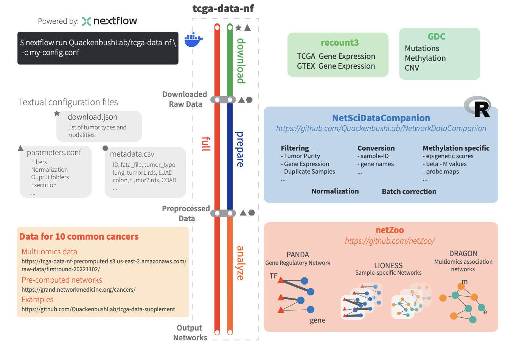

# NetworkDataCompanion
**This package is part of the [Reproducible processing of TCGA regulatory networks](https://www.biorxiv.org/content/biorxiv/early/2024/11/07/2024.11.05.622163.full.pdf) paper available on BioRxiv**

An R library of utilities for performing analyses on TCGA and GTEx data using the Network Zoo (https://netzoo.github.io). This is the engine behind [this Nextflow workflow](https://github.com/QuackenbushLab/tcga-data-nf/tree/main).



# Installing

To install and use the library, you can clone the repository and use the following: 

```R
install.packages("devtools")
devtools::install()  # provided you are in the project folder
library(NetworkDataCompanion) # load the library in your code
```

You can also install directly from GitHub if you do not need the repository itself:

```{R}
library(devtools)
devtools::install_github("QuackenbushLab/NetworkDataCompanion")
library(NetworkDataCompanion)
```

The following packages may require separate installation: "GenomicDataCommons", "edgeR", "recount", "recount3" 

# Usage

```R
## load libraries
library(NetworkDataCompanion)
library(recount)
library(recount3)
library(GenomicDataCommons)

## Obtain expression data from recount
TCGA_lung <- recount3::create_rse_manual(
  project = "LUAD",
  project_home = "data_sources/tcga",
  organism = "human",
  annotation = "gencode_v26",
  type = "gene"
)

## Generate NetworkDataCompanion instance
obj <- CreateNetworkDataCompanionObject(project_name = "LUAD")

## use package functionality, for example
exp_TCGA_lung <- obj$logTPMNormalization(TCGA_lung)
```

A lot more details can be found in [this vignette](./vignettes/introduction.Rmd).

# Structure of the repo
- ```R``` contains the source code of our functions.
- ```vignettes``` contains a tutorial on how to use the package.
- ```tests``` contains extensive tests of the implemented functions.
- ```insts``` contains the data needed to run the analyses on TCGA and GTEx.
- ```man``` is used to generate documentation. 

# Building

We rely on roxygen2 for package building.

```R
install.packages("tinytex")
tinytex::install_tinytex()

library(roxygen2)
roxygen2::roxygenize()

install.packages("devtools")
library(devtools)
devtools::build()
devtools::document()
build_manual(path = ".")
```

## Citation
```bibtex
@article{fanfani2024reproducible,
  title={Reproducible processing of TCGA regulatory networks},
  author={Fanfani, Viola and Shutta, Katherine H and Mandros, Panagiotis and Fischer, Jonas and Saha, Enakshi and Micheletti, Soel and Chen, Chen and Ben Guebila, Marouen and Lopes-Ramos, Camila Miranda and Quackenbush, John},
  journal={bioRxiv},
  pages={2024--11},
  year={2024},
  publisher={Cold Spring Harbor Laboratory}
}
```

If you find this package useful, feel free to star this repository!
